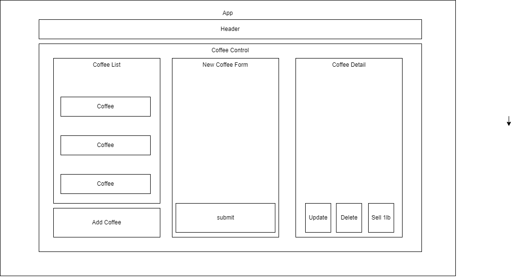

# Coffee Time

## By *_Ryan DeFea_*

## _Description_

_React application that tracks the inventory of a Coffee shop._  

## _Technologies Used_

*javaScript
*HTML
*React

This project was bootstrapped with [Create React App](https://github.com/facebook/create-react-app).

## _Diagram_

## Setup/Installation

* Copy the git repository url to your
* Open gitbash & navigate to desktop
* Clone the repository using the url and "git clone" command
* In gitbash navigate to the root directory of the newly create file called "coffee-time"
* When the file is opened run the "npm install" command in the terminal to install dependencies
* Next, type "npm run start" in the root directory to start the program

## _Known Bugs_

*the decrement feature does not currently function 

## _License_
[MIT](License)

Copyright (c) 2022 Ryan DeFea
